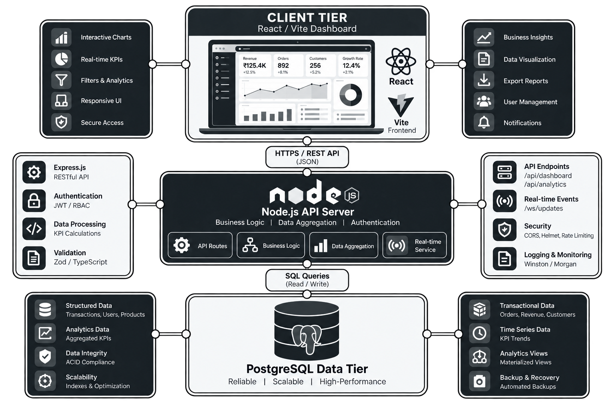

# 📊 Sentinel BI: Executive KPI Dashboard

Sentinel BI is a high-performance, real-time Business Intelligence platform engineered for enterprise leaders to monitor financial health, transactional velocity, and operational telemetry. Built with a "command-center" aesthetic, it bridges the gap between raw PostgreSQL data and executive decision-making.

---

## 🏛️ System Architecture

The Sentinel BI platform utilizes a reactive, decoupled architecture designed for high-frequency data updates without polling overhead.

- **Data Tier:** PostgreSQL persistent storage with optimized indexing on `occurred_at`.
- **Application Tier:** Express middleware handling RESTful resource requests and maintaining persistent SSE connections.
- **Client Tier:** SPA rendering engine that subscribes to the event stream, enabling "zero-refresh" live dashboard updates.

---

## 🗄️ Database & Data Model

We use a normalized relational model optimized for temporal queries.

| Table | Primary Purpose | Key Features |
| :--- | :--- | :--- |
| `customers` | Entity Management | Segment tagging for enterprise analytics |
| `transactions` | Financial Ledger | Indexed `occurred_at` for high-speed time-series retrieval |

---

## 📈 Executive Metrics

Sentinel BI transforms raw logs into high-level business intelligence:
1. **Revenue Velocity:** Hourly throughput tracking.
2. **Order Throughput:** Real-time transaction count.
3. **Customer Acquisition:** Growth in unique active account metrics.
4. **Market Segmentation:** Live revenue share breakdown by account tier.

---

## 📜 License

This project is licensed under the **[MIT License](LICENSE)**.

> © 2026 Sentinel BI Contributors
